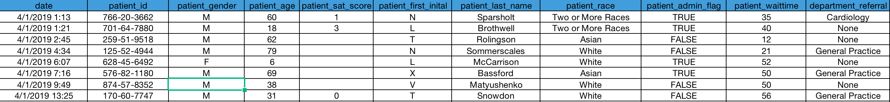
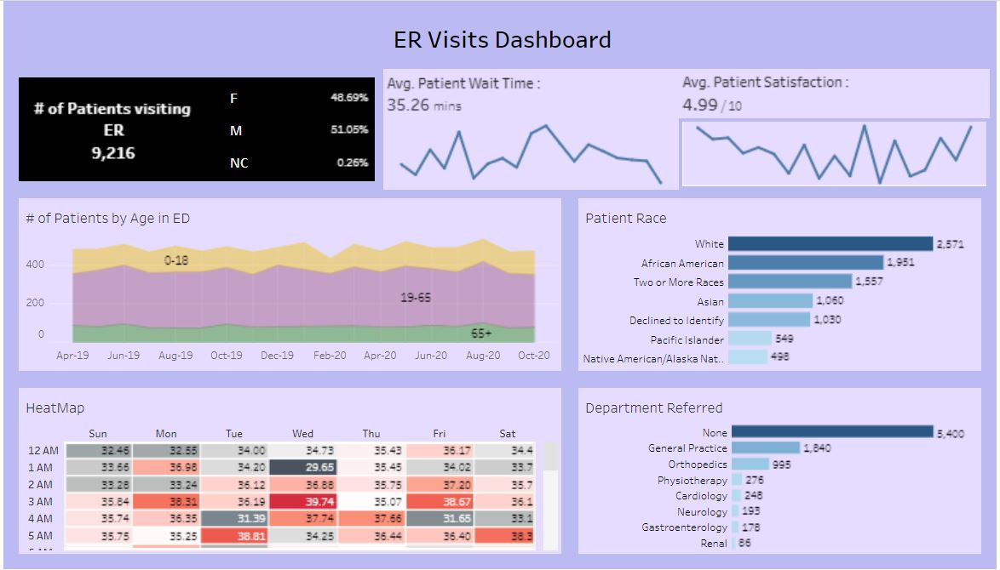

#  Emergency Room Visits

## 📚 About Data
Dataset consists of around 9k records of patients who visited the emergency room between April 2019 - October 2020 capturing information like each patient's visit date, time, patient's id, name, gender, race, wait-time, department they are referred to, satisfaction score. 

## Data snapshot:

## ✏️ Data cleaning

-	Separated the date and time values into two fields instead of one
-	Converted patient's wait-time to minutes
-	Created a separate group for rows with missing/unknown values
-	Hid the patient_admin_flag that was not required
 

## 📊 Visualization

### 💡 Key Insights and Highlights

•	Patient's wait-time and satisfaction score can be compared on a monthly basis and draw inference using monthly graph with average scores for the cumulative values
•	The heat map will show which time of the day is most busy every week depicting the average wait-time for patient's and the color gradient shows most busy hours as dark red to least busy hours as dark gray
•	Age-wise patient distribution (0-18), (19-65), (65+) age over the years can draw inferences for which age bracket patient's has most number of ER visits. Here (19-65) yrs age bracket has most ER visits
•	Race and department referred reports show the highest to lowest patient visits for each of them
•	This visualization shows the 'White' population visiting most and the 'General Practice' department having most patient visits
•	The percentage of male to female patients for different scenarios can be recorded. eg. for each month/time, race, department referred to, the percentage of male and female patient's will vary

ER Visits Tableau [Link](https://public.tableau.com/views/ERHealth/Dashboard1?:language=en-US&:sid=&:redirect=auth&:display_count=n&:origin=viz_share_link)

